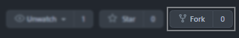

# Contributing to staffBadges

Hello and thanks for taking your time to contribute!

The following is a set of guidelines for contributing to staffBadges. These are mostly
guidelines, not rules. Use your best judgment, and feel free to propose changes to this document in
a pull request.

## Notice

This contribution guideline taken from modified
[Ryuuganime Contribution Guidelines](https://github.com/ryuuganime/contributing) under
[Creative Commmons Zero v1.0 International](https://github.com/ryuuganime/contributing/blob/main/LICENSE).

## Code of conduct

This project and everyone participating in it is governed by the
[Contributor Covenant Code of Conduct version 2.0](CODE_OF_CONDUCT.md). By participating, you are
expected to uphold this code. Please report unacceptable behavior to contact@thenewbieclub.net.

## Commit and pull request

### Forking repository

Forking a repository is a simple two-step process. Please follow this instruction below.

1. Navigate back to the repository root
   ([`theNewbieClub-MAL/staffBadges`](https://github.com/theNewbieClub-MAL/staffBadges)).
   You can pass this step if on Desktop.
2. In the top-right corner of the page, click Fork.<br/>
   

### Cloning repository

To clone this repository you need [Git](https://git-scm.com/downloads) installed on your end and the
repository need to be forked (see: [Forking repository](#forking-repository)) to your
GitHub account. From your command line:

```sh
git clone https://github.com/<YOUR USERNAME>/staffBadges
```

**Note**<br>
Remember to change `<YOUR USERNAME>` into your GitHub username.

### Commit changes

We use [Gitmoji](http://gitmoji.dev/) for easier accessibility.

Commonly, we use it by:

```sh
git commit -m "📝 Update documentation"
```

Keep in note that we use present participle verb each commit.

### Pulling a merge request

<ol>
  <li>Make sure you have required to naming your commit based on
    <a href="#Commit_changes">Commit changes</a> guideline.
  </li>
  <li>Name your pull request as<br />
    <pre><code>Detail: Comment</code></pre>
    <strong>Note</strong>:
    <dl>
      <dt>Detail</dt>
      <dd>Defining what the purpose of this pull request.</dd>
    </dl>
  </li>
  <li>On comment section, fill any information that were required.</li>
  <li>Click on the green "Send pull request" button to finish creating the pull request.</li>
  <li>You should now see an open pull request.</li>
</ol>